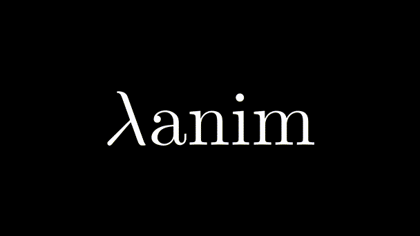

# Welcome to _λanim_!

We're  nowhere near what the GIF promises, but we're working on growing the
documentation and the library itself.

If you want to get started, check out [the tutorial](tutorial/installation).

If you want to see recipes for common use cases, look at [the how-to guides](howtos).

If you want to ask for help or just hang out, join our [Discord server](https://discord.gg/R34zxGQT)
or use [GitHub Discussions](https://github.com/decorator-factory/lanim/discussions)

## Roadmap for the near future:

- Docs:
    - [ ] Make tutorials about all the basic concepts
        - [X] Hello, λanim!
        - [X] The coordinate system
        - [X] Projectors
        - [ ] Imperative `scene` API
        - [ ] APIs offered by `pil_types`
    - [ ] Advanced guides
        - [ ] Animating unexpected things
        - [ ] Type annotations
        - [ ] Defining your own renderable type
    - [ ] Catalogue of examples
        - [ ] Figure out which examples are needed

- Library:
    - [ ] More primitives
        - [ ] Line
        - [ ] Ellipse
    - [ ] More combinators

- Future:
    - [ ] Intended audience? Use cases?
    - [ ] Switching to SVG?
    - [ ] GUI?
