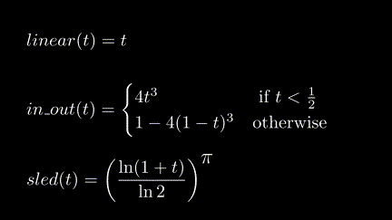

# Hello, λanim!

In this tutorial, we're going to recreate the `lanim.examples.hello` animation.


## 1. Create a stub

Create a file called `tutorial_hello.py` with this content:

```py
from lanim.examples.hello import export
```

Then run `python -m lanim -o hello.mp4 tutorial_hello` in the same directory.

This explains how to make `lanim` animate your module: it needs to export the
animation under the `export` name.

Now we're going to make an

## 2. Create the greeting
```py
from lanim.pil_types import Latex

sign = Latex(x=0, y=0, source=r"Hello, $\lambda$anim!")
```
Theis object doesn't _do_ anything yet --- it's a simple value, like a number
or a string.

## 3. Make a static animation of the sign

```py hl_lines="1 6"
from lanim.anim import const_a
from lanim.pil_types import Latex

sign = Latex(x=0, y=0, source=r"Hello, $\lambda$anim!")

export = const_a(sign)
```
Now try `python -m lanim -o hello.mp4 tutorial_hello` and see what happens.


This animation is only 1 second long, how do we make it longer?


## 3. Stretch the animation
```py hl_lines="6"
from lanim.anim import const_a
from lanim.pil_types import Latex

sign = Latex(x=0, y=0, source=r"Hello, $\lambda$anim!")

export = const_a(sign) * 5
```

The animation now lasts for five seconds.

## 4. Make the sign scale out instead of just sitting there

```py hl_lines="1 6"
from lanim.pil_graphics import appear
from lanim.pil_types import Latex

sign = Latex(x=0, y=0, source=r"Hello, $\lambda$anim!")

export = appear(sign) * 2
```


## 5. Create a border around the greeting
```py hl_lines="1 5-10"
from lanim.pil_types import Latex, Rect

sign = Latex(x=0, y=0, source=r"Hello, $\lambda$anim!")

border = Rect(
    x=0,
    y=0,
    width=sign.width() + 1,
    height=sign.height() + 1
)
```

How do we animate both of them?


## 6. Animate a pair of the greeting and the border
```py hl_lines="1 13 15"
from lanim.pil_graphics import appear
from lanim.pil_types import Latex, Rect, Pair

sign = Latex(x=0, y=0, source=r"Hello, $\lambda$anim!")

border = Rect(
    x=0,
    y=0,
    width=sign.width() + 1,
    height=sign.height() + 1
)

pair = Pair(sign, border)

export = appear(pair)
```


`Pair` is also an ordinary immutable value, like `Latex` and `Rect`.


## 7. Make the last frame persist for a while:

```py hl_lines="1 16"
from lanim.anim import const_a
from lanim.pil_graphics import appear
from lanim.pil_types import Latex, Rect, Pair

sign = Latex(x=0, y=0, source=r"Hello, $\lambda$anim!")

border = Rect(
    x=0,
    y=0,
    width=sign.width() + 1,
    height=sign.height() + 1
)

pair = Pair(sign, border)

export = appear(pair) + const_a(pair)
```


## 8. Make the border appear before the sign

### 8.1. Make the sign appear inside the border
```py hl_lines="2 16"
from lanim.anim import const_a
from lanim.pil_graphics import appear, gbackground
from lanim.pil_types import Latex, Rect, Pair

sign = Latex(x=0, y=0, source=r"Hello, $\lambda$anim!")

border = Rect(
    x=0,
    y=0,
    width=sign.width() + 1,
    height=sign.height() + 1
)

pair = Pair(sign, border)

export = gbackground(appear(sign), [border]) + const_a(pair)
```


`gbackground` accepts an animation and a list of things to put in the background.


### 8.2. Stretch out the border before the greeting animation
```py hl_lines="16"
from lanim.anim import const_a
from lanim.pil_graphics import appear, gbackground
from lanim.pil_types import Latex, Rect, Pair

sign = Latex(x=0, y=0, source=r"Hello, $\lambda$anim!")

border = Rect(
    x=0,
    y=0,
    width=sign.width() + 1,
    height=sign.height() + 1
)

pair = Pair(sign, border)

export = appear(border) + gbackground(appear(sign), [border]) + const_a(pair)
```


### 8.3. Split a complex expression across several lines
```py hl_lines="16-20"
from lanim.anim import const_a
from lanim.pil_graphics import appear, gbackground
from lanim.pil_types import Latex, Rect, Pair

sign = Latex(x=0, y=0, source=r"Hello, $\lambda$anim!")

border = Rect(
    x=0,
    y=0,
    width=sign.width() + 1,
    height=sign.height() + 1
)

pair = Pair(sign, border)

export = (
    appear(border)
    + gbackground(appear(sign), [border])
    + const_a(pair)
)
```

## 9. Move the whole thing down
```py hl_lines="2 20"
from lanim.anim import const_a
from lanim.pil_graphics import appear, gbackground, move_by
from lanim.pil_types import Latex, Rect, Pair

sign = Latex(x=0, y=0, source=r"Hello, $\lambda$anim!")

border = Rect(
    x=0,
    y=0,
    width=sign.width() + 1,
    height=sign.height() + 1
)

pair = Pair(sign, border)

export = (
    appear(border)
    + gbackground(appear(sign), [border])
    + const_a(pair)
    + move_by(pair, dx=0, dy=10)
)
```


---

The animation is doing the action we wanted it to do, but it's not pretty.
Let's fix that.

## 10. Add easings

An [_easing function_](https://easings.net/) allows you to change the "shape"
of the change.

=== "Animation"

    Here you can see that

    - The _linear_ easing moves at a steady pace
    - The _in-out_ easing has a gentle start and end
    - The _sled_ easing starts out slow and then accelerates

    

=== "Formulas"

    An easing is a function from `[0; 1]` to `[0; 1]`.

    You can see their graphs in action on [Desmos](https://www.desmos.com/calculator/ljbkaftbej)

    


```py hl_lines="4 19 21"
from lanim.anim import const_a
from lanim.pil_graphics import appear, gbackground, move_by
from lanim.pil_types import Latex, Rect, Pair
from lanim.easings import in_out, sled

sign = Latex(x=0, y=0, source=r"Hello, $\lambda$anim!")

border = Rect(
    x=0,
    y=0,
    width=sign.width() + 1,
    height=sign.height() + 1
)

pair = Pair(sign, border)

export = (
    appear(border)
    + gbackground(appear(sign), [border]).ease(in_out)
    + const_a(pair)
    + move_by(pair, dx=0, dy=10).ease(sled)
)
```


## 11. Adjust durations

Timing is crucial. It's like the accents and intonation in speech.

Let's spice our animation up by tweaking some of the durations.

```py hl_lines="18 20"
from lanim.anim import const_a
from lanim.pil_graphics import appear, gbackground, move_by
from lanim.pil_types import Latex, Rect, Pair
from lanim.easings import in_out, sled

sign = Latex(x=0, y=0, source=r"Hello, $\lambda$anim!")

border = Rect(
    x=0,
    y=0,
    width=sign.width() + 1,
    height=sign.height() + 1
)

pair = Pair(sign, border)

export = (
    appear(border) * 0.5
    + gbackground(appear(sign), [border]).ease(in_out)
    + const_a(pair) * 0.25
    + move_by(pair, dx=0, dy=10).ease(sled)
)
```


## Recap

In this tutorial, you've learned how to:

1. Export a simple animation from a Python module
2. Create graphical objects, namely `Latex`, `Rect` and `Pair`
3. Animate still frames, as well as scale out and move objects
4. Change the duration of animations
5. Put animations in sequence
6. Use easings to make transitions more interesting

